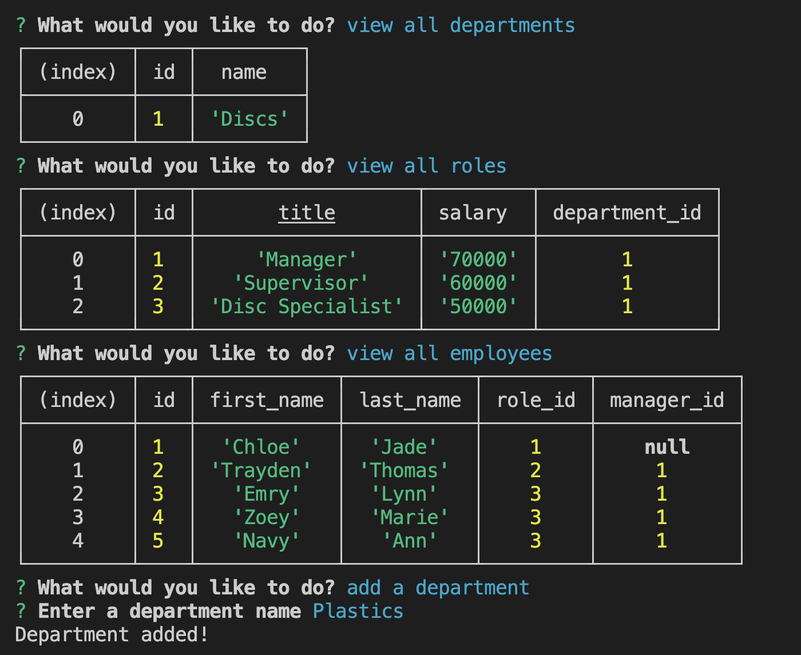

# Employee_Tracker

## Description

This is a tool designed to create a database of departments, roles, and employees. 

## Installation

1. Open VS Code Terminal
2. Enter `npm i inquirer@8.2.4` into the command line

## Usage

1. Open "Employee_Tracker" in Visual Studio Code
2. Open Integrated Terminal
3. Run "nmp i" in the command line to install all node packages
4. Type "node index.js" into the command line
5. Follow the prompted questions to create your database of employees.

## Future Implementation

With more time I plan to:
  - Complete the functionality to update the role of an employee
  - Update employee managers
  - View employees by manager
  - View employees by department
  - Delete departments, roles, and employees

## Credits

- referenced past course work and material
- installed npm packages 
    - node.js
    - Inquirer
    - mysql2
    - express
    - console.table

## License

  
---