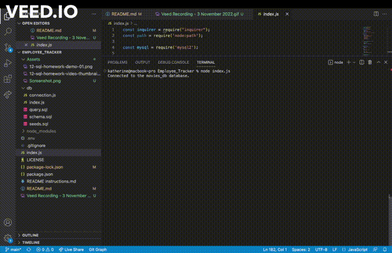

# Employee_Tracker

## Description

This is a tool designed to create a database of departments, roles, and employees. 

## Installation

1. Open VS Code Terminal
2. Enter `npm i` into the command line
3. Run `mysql -u root -p`
4. Run `SOURCE schema.sql`
5. Seed the database asynchronously. If using terminal:
    - open "db" folder
    - open "seeds.sql"
    - copy lines 1-4 into the terminal 
    - copy lines 6-9 into the terminal
    - copy lines 11-16 into the terminal
6. exit mysql
7. run `node index.js`

## Usage

1. Follow the steps under Installation to get started
2. Follow the prompted questions to create your database of employees, roles, and departments.

## Future Implementation

With more time I plan to:
  - Complete the functionality to update the role of an employee
  - Update employee managers
  - View employees by manager
  - View employees by department
  - Delete departments, roles, and employees

## Take a look

Walkthrough video: https://www.awesomescreenshot.com/video/12217119?key=38b57f1ac8ae52abf296a9c43db361b1

Screenshot:

## Credits

- referenced past course work and material
- installed npm packages 
    - node.js
    - Inquirer
    - mysql2
    - express
    - console.table
- Veed.io for the gif
- Screencastify for the walkthrough video

## License

  
---